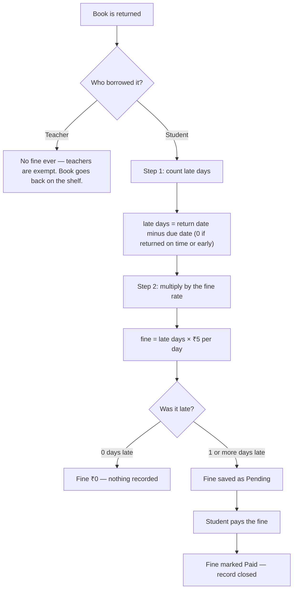
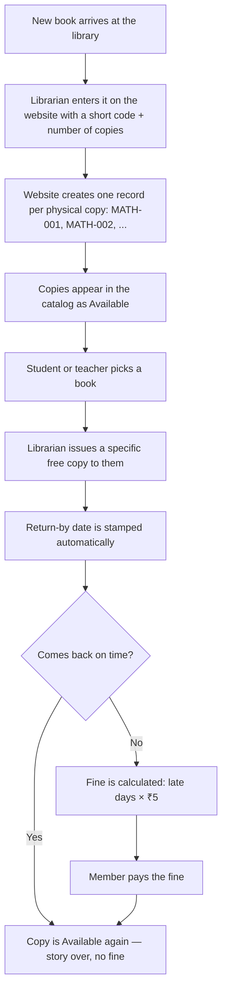
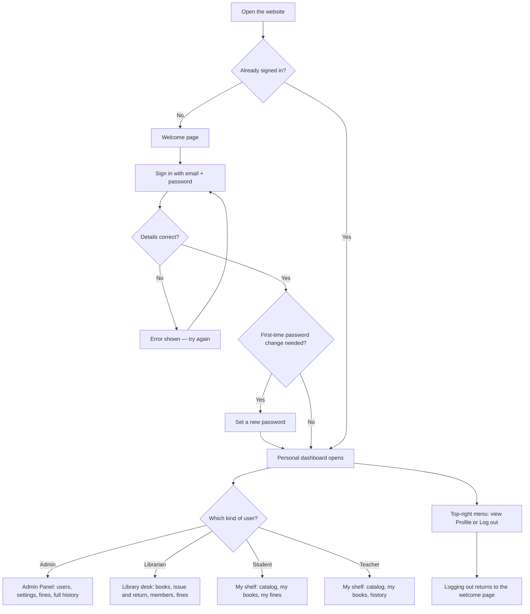
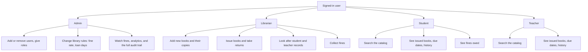
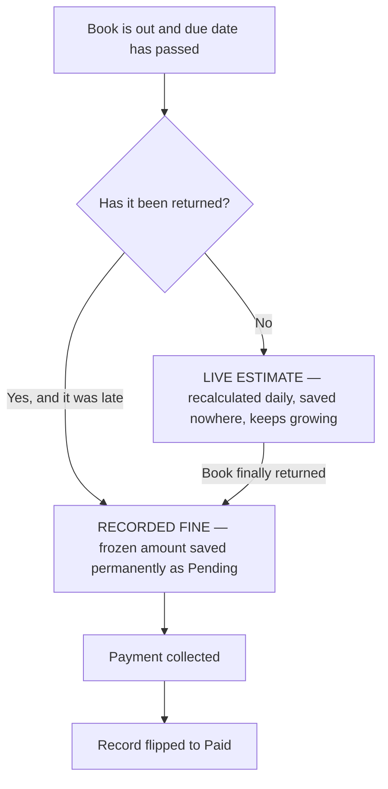

# LibSys — Library Management System Flowcharts

**Project:** College Library Management System (LibSys)
**Built with:** React website (Vercel) · Node.js server (Render) · PostgreSQL database (Neon)
**Users:** Admin · Librarian · Student · Teacher

> **How to view:** open this file on GitHub (diagrams draw themselves automatically),
> or paste any diagram into [mermaid.live](https://mermaid.live) to download PNG / SVG / PDF.
>
> **Who is this for:** written so that even someone with no technical background
> (e.g. a fellow student or mentor from another department) can follow how the
> library runs and exactly how fines are calculated.

---

## 1. LibSys in one paragraph (plain English)

LibSys is a website that runs a college library. Instead of paper registers, everything
is recorded on the website: which books the library owns, which student or teacher is
holding which copy, when it must come back, and what fine is owed if it comes back late.
There are four kinds of users — **Admin** (full control), **Librarian** (runs daily work),
**Student** and **Teacher** (borrow and read). Every book copy has its own code, like
`MATH-001`, so the library always knows exactly which physical book is where.

---

## 2. A real story: Amit borrows a book (follow the dates)

Meet **Amit**, a student. The library rule is: **a student may keep a book for 7 days**,
and **late return costs ₹5 per day**. Watch what happens:

| Day | Date | What happens |
|-----|------|--------------|
| Day 1 | 1 Sept | Amit takes copy `MATH-001`. Librarian records it on the website. Return-by date is set: **8 Sept**. |
| Day 7 | 8 Sept | Last day — no fine if returned today. |
| Day 8 | 9 Sept | 1 day late → fine so far **₹5**. The website starts showing "Overdue". |
| Day 12 | 13 Sept | Amit returns the book, **5 days late**. Fine = 5 × ₹5 = **₹25**. |
| Day 12 | 13 Sept | Amit pays ₹25. Fine marked **Paid**. Copy `MATH-001` is free for the next reader. |

If Amit had returned on or before 8 Sept, the fine would have been **₹0** — on-time return
is always free.

---

## 3. Fine calculation, step by step (the exact rule the system uses)

The website applies this rule automatically every time a book is returned:

### Worked example (same numbers as Amit's story)

- Due date: **8 Sept**, returned: **13 Sept**
- Step 1: 13 − 8 = **5 days late**
- Step 2: 5 × ₹5 = **₹25 fine**
- Status changes: **Pending → Paid** once Amit pays.

### Things worth knowing

- The **₹5 per day** rate and the **7-day loan period** are not hard-coded — the Admin can
  change them in Library Settings (students and teachers can even have different loan periods).
- While a book is still out and already late, dashboards show a **live estimate**
  ("5 days late → about ₹25 so far"), which grows by ₹5 each day until return.
- The final, exact fine is frozen at the moment of return and stored as a record.

---

## 4. Big-picture workflow (the whole system in one diagram)

---

## 5. Login and who-sees-what (detailed)

Behind the scenes: passwords are stored scrambled (never readable), sign-in lasts safely
using short-lived passes that renew themselves, and each page refuses entry to the wrong
kind of user (a student link never opens for a teacher).

---

## 6. What each role does, day to day

---

## 7. Live estimate vs recorded fine (the two kinds of fine)

There are only two situations, and the system treats them differently:

**Situation A — book is STILL with the student and already late → "live estimate"**
- Nothing is saved anywhere yet. Every time you open the dashboard, the system
  freshly calculates: *(today − due date) × ₹5*.
- It grows by ₹5 every midnight and **vanishes the moment the book is returned**.
- Think of it like a **taxi meter still running** — it shows what you *would* owe
  if you stopped right now.

**Situation B — book was RETURNED late → "recorded fine"**
- At the second of return, the system freezes the number and writes one permanent
  row in the fine register: *who, which book, how many days late, exact amount*,
  marked **Pending**.
- This number **never changes again**. It only flips Pending → **Paid** when money is collected.
- Think of it like the **printed final bill** — fixed forever.

### Follow Amit's one book through both stages

| Date | Book status | What the dashboard shows |
|------|-------------|--------------------------|
| 9 Sept | Still with Amit, 1 day late | Live estimate **₹5** (no record saved) |
| 10 Sept | Still with Amit, 2 days late | Live estimate **₹10** (still nothing saved) |
| 13 Sept morning | Still with Amit, 5 days late | Live estimate **₹25** |
| 13 Sept, return | **Returned** 5 days late | Estimate disappears; permanent record created: **5 days, ₹25, Pending** |
| 13 Sept, payment | Returned + paid | Record flipped to **Paid** — matter closed |

### Why the dashboard adds both together

The **Pending Fines** tile answers one question: *"how much money do members owe us right now?"*
That is two piles added up:

> **Pending Fines = frozen unpaid bills (recorded) + taxi meters still running (live estimates)**

So the total can rise overnight even if nobody returns a book — it just means someone's
meter ticked another ₹5. And when that book comes back, the meter amount converts into a
frozen bill of (almost) the same value — the total barely moves at that moment, it just
changes *type* from estimate to record.

---

## 8. Small glossary (words used above)

| Word | What it means here |
|------|--------------------|
| Copy code (`MATH-001`) | ID painted on one physical book, so each copy is individually trackable |
| Due date | The must-return-by date, stamped automatically at issue time |
| Overdue | Today is past the due date and the book is still out |
| Pending fine | A fine that is calculated but not yet paid |
| Paid fine | A fine the member has settled — the record is closed |
| Loan period | How many days a borrower may keep a book (default: 7 for students) |
| Fine rate | Money charged per late day (default: ₹5, changeable by Admin) |
| Catalog | The searchable list of every book the library owns |
| Audit trail | A tamper-proof diary of who did what and when (admin eyes only) |
