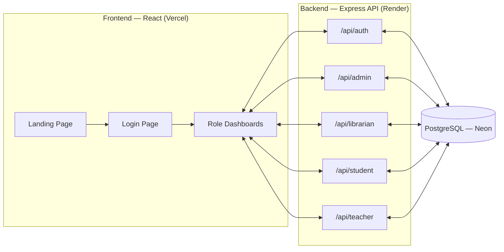
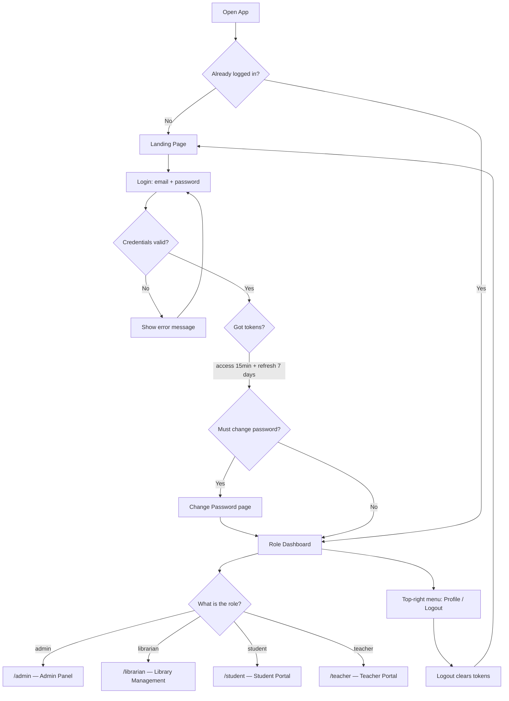
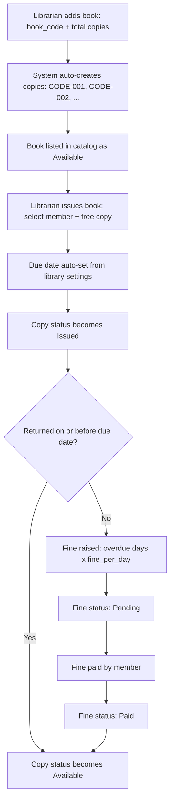
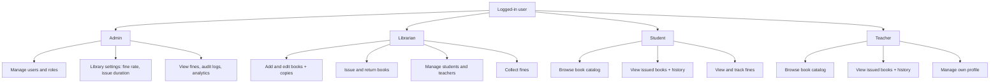
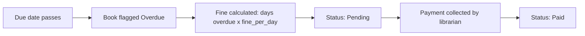

# LibSys — Library Management System Flowcharts

**Project:** College Library Management System (LibSys)
**Stack:** React 18 (Vercel) · Express + Node.js (Render) · PostgreSQL (Neon)
**Roles:** Admin · Librarian · Student · Teacher

> How to view: open this file on GitHub (diagrams render automatically), or paste any
> diagram into [mermaid.live](https://mermaid.live) to export PNG / SVG / PDF.

---

## 1. System Architecture — how the parts connect

- The React app serves the landing page, login, and four role-based dashboards.
- Every dashboard talks to the Express REST API over HTTPS with a JWT Bearer token.
- All data lives in a single PostgreSQL database (tables: `users`, `books`,
  `book_copies`, `issued_books`, `fines`, `students`, `teachers`, `librarians`,
  `audit_logs`, `refresh_tokens`, `system_config`).

---

## 2. Authentication & Role Routing — login to dashboard

- Passwords are stored as bcrypt hashes, never plain text.
- The short-lived access token auto-refreshes using the refresh token, so users stay signed in.
- Every protected route checks the role — a student URL cannot be opened by a teacher, and vice versa.

---

## 3. Book Circulation — the core library workflow (add → issue → return)

- Each physical copy has a unique code (`MATH-001`), so the exact copy is always traceable.
- Durations (`issue_duration_days`) and rates (`fine_per_day`) come from system config — no hard-coding.
- Every issue, return, and payment is written to `audit_logs`.

---

## 4. Role-wise Features — what each user can do

---

## 5. Fine Lifecycle — overdue to paid

- Overdue fines are estimated live on dashboards and confirmed as records in the `fines` table.
- Members see their own fines; librarians collect; admins oversee the totals.
