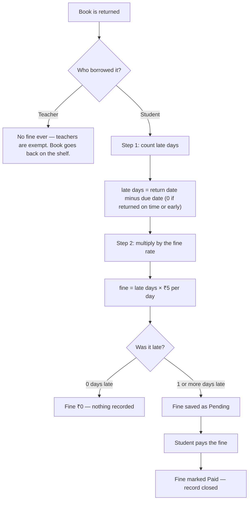
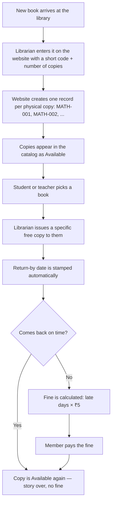
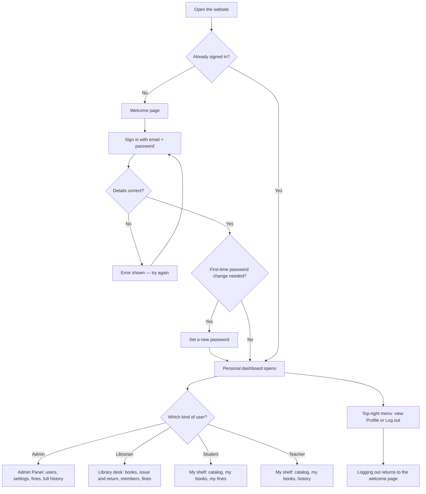
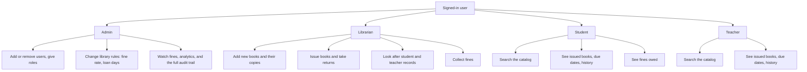
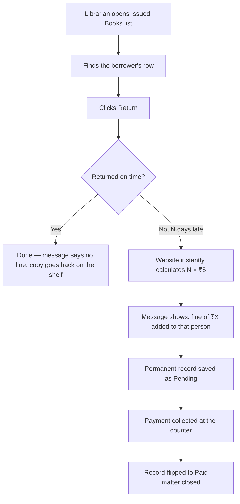
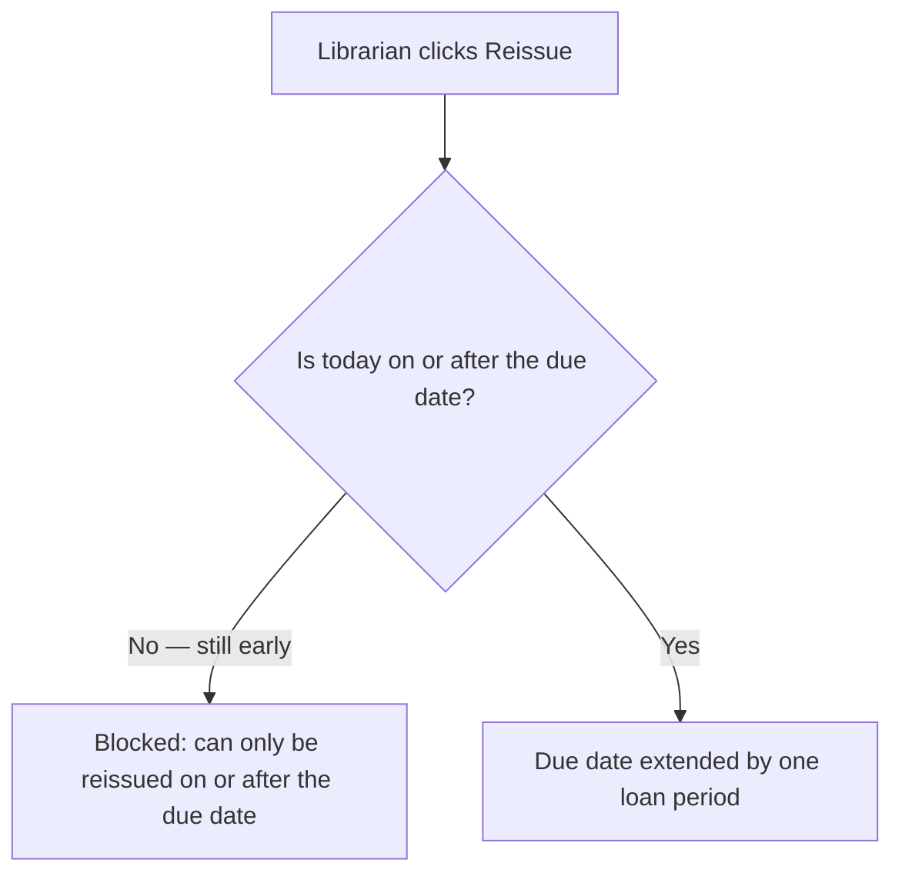

# LibSys — Library Management System Flowcharts

**Project:** College Library Management System (LibSys)
**Built with:** React website (Vercel) · Node.js server (Render) · PostgreSQL database (Neon)
**Users:** Admin · Librarian · Student · Teacher

> **How to view:** open this file on GitHub (diagrams draw themselves automatically),
> or paste any diagram into [mermaid.live](https://mermaid.live) to download PNG / SVG / PDF.
>
> **Who is this for:** written so that even someone with no technical background
> (e.g. a fellow student or mentor from another department) can follow how the
> library runs and exactly how fines are calculated.

---

## 1. LibSys in one paragraph (plain English)

LibSys is a website that runs a college library. Instead of paper registers, everything
is recorded on the website: which books the library owns, which student or teacher is
holding which copy, when it must come back, and what fine is owed if it comes back late.
There are four kinds of users — **Admin** (full control), **Librarian** (runs daily work),
**Student** and **Teacher** (borrow and read). Every book copy has its own code, like
`MATH-001`, so the library always knows exactly which physical book is where.

---

## 2. A real story: Amit borrows a book (follow the dates)

Meet **Amit**, a student. The library rule is: **a student may keep a book for 7 days**,
and **late return costs ₹5 per day**. Watch what happens:

| Day | Date | What happens |
|-----|------|--------------|
| Day 1 | 1 Sept | Amit takes copy `MATH-001`. Librarian records it on the website. Return-by date is set: **8 Sept**. |
| Day 7 | 8 Sept | Last day — no fine if returned today. |
| Day 8 | 9 Sept | 1 day late → the book now shows an **Overdue** badge in the issued list. No rupee amount is shown yet — the fine is calculated only at return. |
| Day 12 | 13 Sept | Amit returns the book, **5 days late**. The librarian clicks **Return** and the website instantly calculates: 5 × ₹5 = **₹25 fine added to Amit**. |
| Day 12 | 13 Sept | Amit pays ₹25. Fine marked **Paid**. Copy `MATH-001` is free for the next reader. |

If Amit had returned on or before 8 Sept, the fine would have been **₹0** — on-time return
is always free.

---

## 3. Fine calculation, step by step (the exact rule the system uses)

The website applies this rule automatically every time a book is returned:

### Worked example (same numbers as Amit's story)

- Due date: **8 Sept**, returned: **13 Sept**
- Step 1: 13 − 8 = **5 days late**
- Step 2: 5 × ₹5 = **₹25 fine**
- Status changes: **Pending → Paid** once Amit pays.

### Things worth knowing

- The **₹5 per day** rate and the **7-day loan period** are not hard-coded — the Admin can
  change them in Library Settings (students and teachers can even have different loan periods).
- No fine exists until the book comes back — an overdue book simply shows an
  **Overdue** badge with the days-late count. The rupee amount appears only when the
  librarian clicks **Return**.
- The fine is calculated once, at return, and stored as a permanent record.

---

## 4. Big-picture workflow (the whole system in one diagram)

---

## 5. Login and who-sees-what (detailed)

Behind the scenes: passwords are stored scrambled (never readable), sign-in lasts safely
using short-lived passes that renew themselves, and each page refuses entry to the wrong
kind of user (a student link never opens for a teacher).

---

## 6. What each role does, day to day

---

## 7. One simple fine rule (fine exists only at return)

There is only **one** kind of fine, and it is born at a single moment — when the
librarian clicks **Return**:

### Follow Amit's one book through each stage

| Date | Book status | What the librarian sees |
|------|-------------|--------------------------|
| 9 Sept | Still with Amit, 1 day late | Row shows **Overdue** badge — no rupee amount anywhere |
| 10 Sept | Still with Amit, 2 days late | Row shows **Overdue** badge — still no amount |
| 13 Sept, clicks Return | **Returned** 5 days late | Message: *"Book returned. 5 days late — fine of ₹25 added to Amit Sharma."* Record saved as **Pending** |
| 13 Sept, payment | Returned + paid | Record flipped to **Paid** — matter closed |

### The reissue rule (renewals)

The **Reissue** button extends the due date — and it follows one strict rule:

- **Before the due date:** the button is disabled. A book still inside its loan period
  cannot be reissued — it must first reach (or pass) its due date.
- **On or after the due date:** the button works, and the due date moves forward again.
- **Teachers:** never have due dates, so Reissue never applies to them.

---

## 8. Small glossary (words used above)

| Word | What it means here |
|------|--------------------|
| Copy code (`MATH-001`) | ID painted on one physical book, so each copy is individually trackable |
| Due date | The must-return-by date, stamped automatically at issue time |
| Overdue | Today is past the due date and the book is still out |
| Pending fine | A fine that is calculated but not yet paid |
| Paid fine | A fine the member has settled — the record is closed |
| Loan period | How many days a borrower may keep a book (default: 7 for students) |
| Fine rate | Money charged per late day (default: ₹5, changeable by Admin) |
| Catalog | The searchable list of every book the library owns |
| Audit trail | A tamper-proof diary of who did what and when (admin eyes only) |
